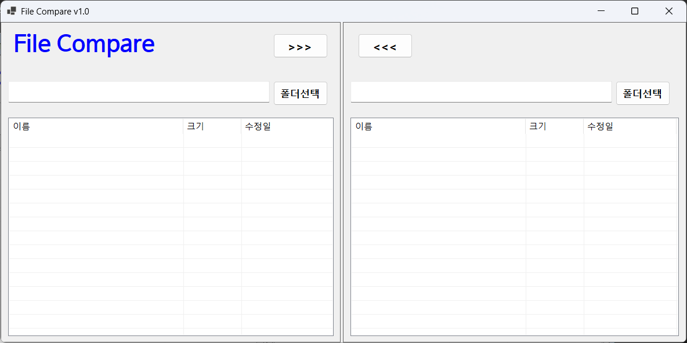
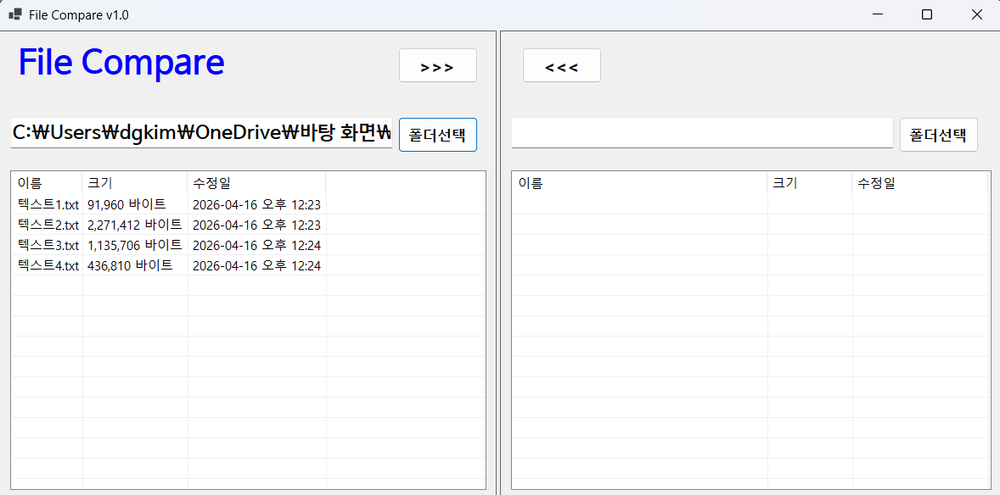
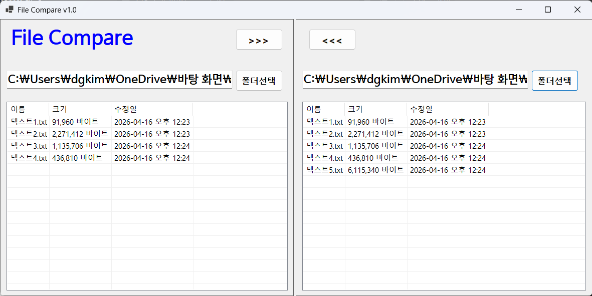
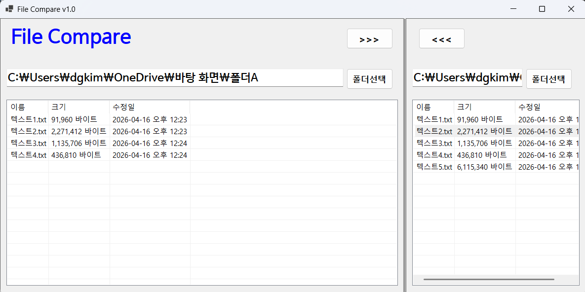
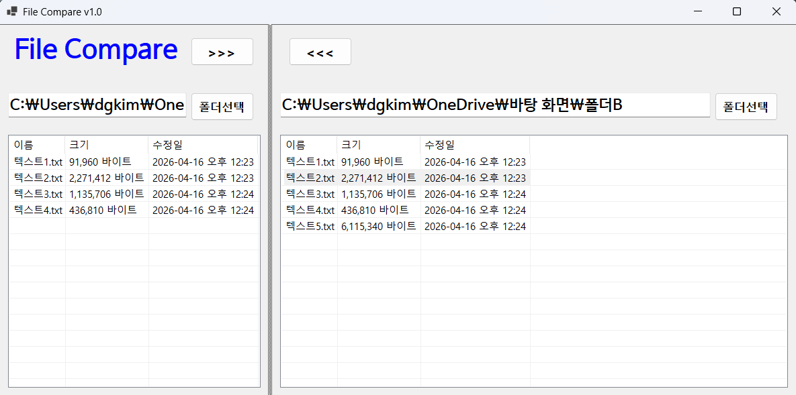

# (C# 코딩) File Compare Tool (파일 비교 툴)

## 개요
- 두 폴더의 파일들을 비교해서 상호 복사하는 툴

## 실행화면 (과제1)
- 코드의 실행 스크린샷과 구현 내용 설명

- 구현한 내용 (위 그림 참조)
	- SplitContainer, Panel, Label, Button, TextBox, ListView 컨트롤을 사용하여 UI 구성
	- FolderBrowserDialog를 사용하여 폴더 선택 기능 구현
	- 컨트롤의 기본 기능 확인과 구현
	- Anchor 속성을 활용하여 Button과 TextBox, ListView의 위치 고정